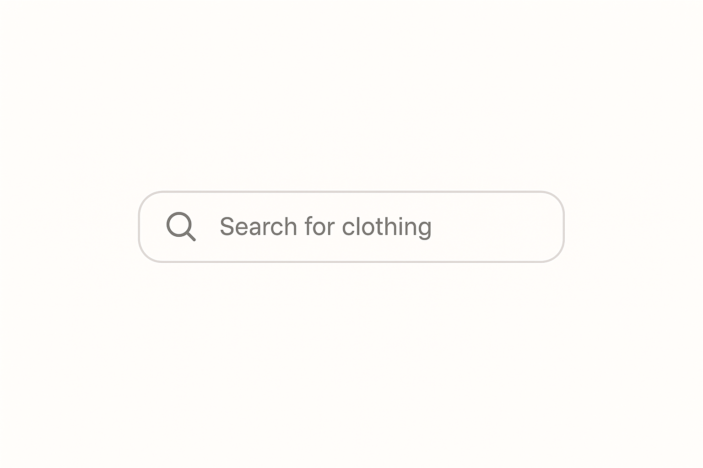
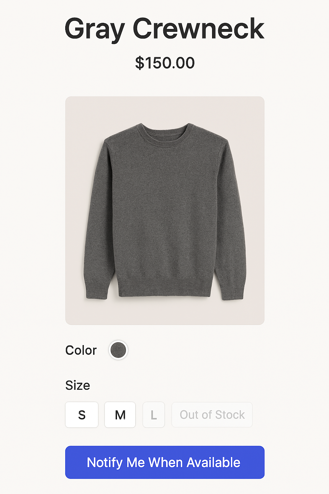

# 2025_Open-07
# Title
  Smart Outfit Viewer

# Abstract
  이 프로젝트는 사용자가 입력한 의류정보를 기반으로 해당 상품의 가격과 색상, 사이즈에 따른 품절을 보여주고 재입고 알림을 설정할 수 있는 웹페이지입니다.
  가격과 구매 가능여부를 직관적으로 보여주어 사용자 경험을 개선하고, 쇼핑 시 실질적인 도움을 주는 것을 목표로 합니다.

# Project Preview
  
  
  위 이미지는 웹페이지의 메인 화면 예시입니다.  

# Project Schedule

| 기간 | 내용 |
|------|------|
| 10월 31일 | 프로젝트 주제 선정 및 GitHub README 파일 작성|
| 11월 1일 ~ 11월 11일 | UI 디자인 및 기본 기능 구현 |
| 11월 12일 ~ 11월 25일 | UI 피드백 및 의류 정보 API연동 |
| 11월 26일 ~ 12월 2일 | API 테스트 및 기능 보완 |
| 12월 13일 ~ 12월 17일 | 최종 배포 및 마무리 |

# Team Roles & Development Areas

| 이름 | 역할 | 담당 영역 |
|------|------|------------|
| 조영훈 | 팀장 | javascript 영역 구현, API 연동 |
| 최종윤 | 팀원 | CSS 디자인, API 연동 |
| 유정호 | 팀원 | html 영역 구현, API 연동 |
* API는 연동 및 구현, 디자인 과정에서 구체적 역할 재분배 예정
  
# Technologies Used

  **Frontend**
    - HTML, CSS, JavaScript

  **API**
    - 의류 사이트 및 쇼핑몰 사이트 API
  
 **Deployment**
    - GitHub Pages (정적 웹사이트 배포)